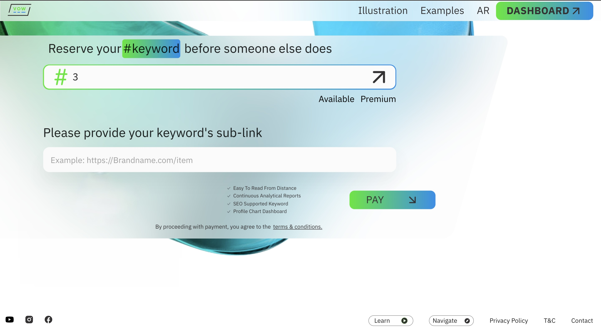

# Important Source Code

Input field for the hashtag that changes stae depending on the length of the hashtag input value and whether or not the hashtag is available

```js
<OutlinedInput
  inputProps={{
    minLength: 1,
    maxLength: 13,
    pattern: allowedCharacters.test(values.hashtag),
  }}
  name="hashtag"
  sx={{
    width: "100%",
    height: {
      xs: "63px",
      md: "80px",
      xl: "80px",
    },
    fontSize: {
      xs: "18px",
      sm: "22px",
      md: "28px",
      xl: "32px",
    },
    lineHeight: "28px",
    background: "#FBFBFB",
    borderRadius: "20px",
    border: "1px solid #E3E3E3",
    ".MuiOutlinedInput-notchedOutline": {
      border: "0",
      padding: "9px",
    },
    "&:hover > .MuiOutlinedInput-notchedOutline": {
      border: "0",
    },
    "& input::placeholder": {
      fontSize: { xs: "18px", md: "22px", xl: "26px" },
    },
  }}
```

---

```js
  // className="borderSubscribeInput"
  value={values?.hashtag}
  placeholder={`${t("input_hashtag_one")}`}
  startAdornment={<BsHash color="#31E716" size={90} />}
  endAdornment={
    isSearching ? (
      <CircularProgress sx={{ color: "#343132" }} size={40} />
    ) : locale === "ar" ? (
      showAngledArrow && <FiArrowUpLeft color="#343132" size={90} />
    ) : (
      showAngledArrow && <FiArrowUpRight color="#343132" size={90} />
    )
  }
  className={`${!isInputValid ? "inputError" : ""} ${
    (values?.hashtag?.length === 1 ||
      values?.hashtag?.length === 2 ||
      values?.hashtag?.length === 3) &&
    !keywordFound
      ? "borderSubscribeInput"
      : ""
  }`}
  onChange={handleChange}
/>
```

---

Checks if the hashtag input value is an emoji or not

```js
function isEmoji(encodedValue: string) {
  const flagRegex = /[\uD83C][\uDDE6-\uDDFF][\uD83C][\uDDE6-\uDDFF]/;
  const emojiRegex = /[\uD800-\uDBFF][\uDC00-\uDFFF]/;
  if (encodedValue.length == 4 && flagRegex.test(encodedValue)) {
    return true;
  } else if (encodedValue.length == 2 && emojiRegex.test(encodedValue)) {
    return true;
  } else {
    return false;
  }
}
```

---


