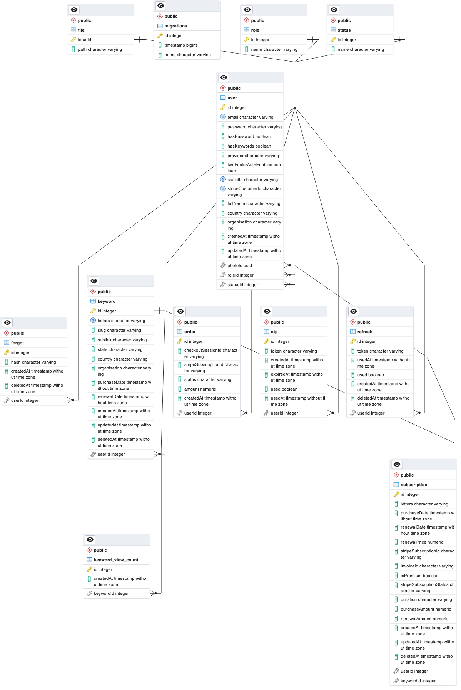

# Database Schema

## Description

The following database schema shows the relationship between all 12 tables in the PostgreSQL database. The tables are connected by primary and foreign keys. The primary keys are shown in as the third item in each block and the foreign keys are shown in at the end of each block. The tables are connected by the following relationships:

- One to One
- One to Many

---

